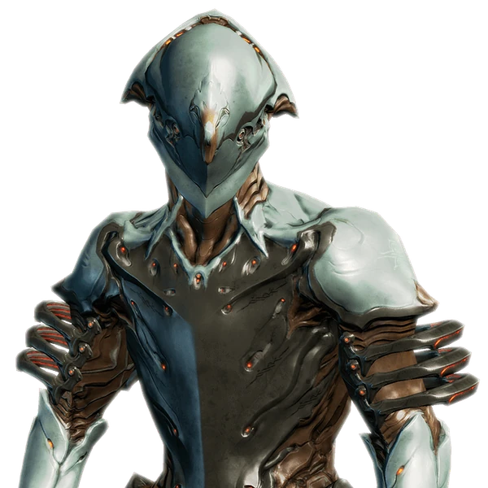

# Warframes débutants

## Starters

Les 3 starters sont bons, prenez ce qui vous semble le plus cool/sympa & vous pourrez toutes les obtenir au final.

{ width="100" align=right }

- **[Volt](https://wiki.warframe.com/w/Volt)** : la plus populaire chez les joueurs même accomplis. Orientée vitesse et boosts électriques.
??? note "Volt : détails"
    - Court vite & tape vite en mếlée (sort 2)
    - a un bouclier pare-balles qui boost les crits et rajoute des dégâts électriques (sort 3)
    - a un nuke + contrôle AoE électrique (sort 4, utile plus tard avec + de mods)

{ width="100" align=right }

- **[Excalibur](https://wiki.warframe.com/w/Excalibur)** : la frame emblématique du jeu. Orientée mếlée (épée). Ulti qui claque.

??? note "Excalibur : détails"
    - bonus passif avec épées : 10% dmg et 10% attack speed
    - a un dash avant (sort 1)
    - du CC : le 2 blind les ennemis (et les cameras !) et les ouvre aux finishers, le 3 dps un peu en prime
    - a un ultime (sort 4) avec une épée spectrale qui envoie des lames d'énergie à distance.

{ width="100" align=right }

- **[Mag](https://wiki.warframe.com/w/Mag)** :  Très complète. Orientée caster, contrôle et régénération de boucliers.

??? note "Mag : détails"
    - passif : un aspirateur a loot intégré très pratique
    - peut attirer les ennemis en pack pour la mêlée (sort 1)
    - a beaucoup de contrôle (1, 2, 4)
    - peut récupérer ses shields (3, 4)
    - peut contrôler des zones avec son 2, qui attire les ennemis, intercepte et fait ricocher tous les projectiles en infligeant des dégats basés sur ces derniers
    - Réduit l'armure et les boucliers ennemis (3, voire 4 plus tard)

-----

## Frames Early

Liste des frames accessibles tôt dans le jeu et utiles à tous les débutants.
Les frames de dojo ne sont pas présentes car nécessitent des ressources dures à avoir au tout début ([Argon]() du Néant, Nitain des [Ondes Nocturnes](https://wiki.warframe.com/w/Nightwave), etc)

- [Gara](https://wiki.warframe.com/w/Gara) : Tanky, peut nuke et défendre des zones (farm Terre, quête [Saya's Visions](https://wiki.warframe.com/w/Saya%27s_Vigil) + mises à prix [Cetus](https://wiki.warframe.com/w/Gara#Acquisition))
- [Koumei](https://wiki.warframe.com/w/Koumei) : Tanky, se craft très facilement, pas de prime donc investissement forma/autres "rentable" (farm Terre, [Saya's Visions](https://wiki.warframe.com/w/Saya%27s_Visions))
- [**Rhino**](https://wiki.warframe.com/w/Kullervo) : TRES tanky, bon bonus de dégâts (farm Venus, [Jackal](https://wiki.warframe.com/w/Jackal))
- [Hydroid](https://wiki.warframe.com/w/Hydroid) : bon buff armes + tanking OK + corrosif amélioré pour réduire l'armure ennemie (farm Terre, [Vay Hek](https://wiki.warframe.com/w/Councilor_Vay_Hek))
- [**Kullervo**](): Tanky, gros buff melee, pas de prime donc investissement forma/autres "rentable" (farm Expérience [Duviri](https://wiki.warframe.com/w/Kullervo#Acquisition), un peu plus dur à farm mais excellent)
- [Frost](https://wiki.warframe.com/w/Frost) : Tanky voire très tanky ([mod augment]()), enlève l'armure des ennemis, excellent en Défense (farm Ceres, [Exta](https://wiki.warframe.com/w/Exta))

-----

## Frames de farm

Certaines frames ont des capacités améliorant les drops de Ressources. Dans un looter-shooter, pouvoir farmer plus rapidement/efficacement est une des priorités.

- [Nekros](https://wiki.warframe.com/w/Nekros) : prioritaire, utile solo et en groupe, le plus simple à obtenir. Frame "meta" pour boost le farm ressource (farm Deimos, [Magnacidium](https://wiki.warframe.com/w/Magnacidium)). Utiliser le mod augment [Despoil](https://wiki.warframe.com/w/Despoil).
- [Khora](https://wiki.warframe.com/w/Khora) : 2nde priorité, cumule ses bonus de drop avec Nekros mais plus dure à obtenir. L'autre frame "meta" pour boost le farm ressource (préférer une rotation [Circuit Duviri](https://wiki.warframe.com/w/The_Circuit#Normal_Circuit) normal ou obtenir la Prime). Utiliser le mod augment [Pilfering Strangledome](https://wiki.warframe.com/w/Pilfering_Strangledome)
- !!! note "autres / facultatives"
    - [Nova](https://wiki.warframe.com/w/Nova) : bonus pour le farm en groupe. N'augmente pas les loots directements mais peut augmenter la vitesse de course des ennemis, permettant d'accélérer le farm en Survie / Défense : en complément de Nekros+Khora
    - [Hydroid](https://wiki.warframe.com/w/Hydroid) : avec l'augment [Pilfering Swarm](https://wiki.warframe.com/w/Pilfering_Swarm), peu utilisé : en compétition avec le bonus drop de Khora qui a un % inférieur MAIS touche beaucoup plus d'ennemis à la fois, la rendant supérieure. Bien en dépannage.
    - [Ivara](https://wiki.warframe.com/w/Ivara) : l'invisibilité permet de "faire les poches" : techniquement compatible avec Nekros+Khora, mais trop lent pour être viable.
    - [Atlas](https://wiki.warframe.com/w/Atlas) : avec l'augment [Ore Gaze](https://wiki.warframe.com/w/Ore_Gaze) du 3, peu utilisé car incompatible avec Khora+Nekros (les ennemis pétrifié sont insensibles à la cage + les corps ne peuvent pas être découpés pour Nekros). Demande beaucoup de puissance.
