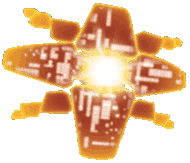

---
hide:
  - navigation
  - toc
---

  

  

  

    

      <h1 class="custom-gradient-title">Warframe Guides</h1>
      
Community guides by Mijka and others.
      

    

    

      
Multi-lingual :
        <a href="/fr/" class="lang-link">français</a> •
        <a href="/en/" class="lang-link">english</a>.
      

      
    

  

-   ###:material-clock-fast:{ .lg .middle } __Débutant__

    ---

    Tout pour bien débuter au jeu

    [:octicons-arrow-right-24: Getting started](beginner)

-   ###:fontawesome-brands-markdown:{ .lg .middle } __Steelpath__

    ---

    Le "hard mode" de Warframe, à portée de tous

    [:octicons-arrow-right-24: Reference](steelpath/)

-   ###:fontawesome-brands-markdown:{ .lg .middle } __Checklist Hebdo__

    ---

    Récapitulatif du contenu hebdomadaire offrant les meilleures récompenses

    [:octicons-arrow-right-24: Reference](/weekly-checklist)

