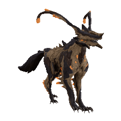
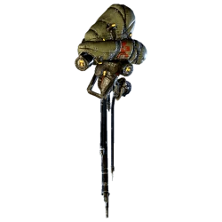
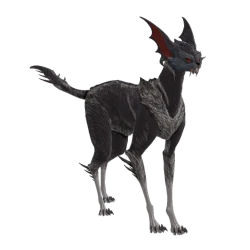

Les [compagnons](https://wiki.warframe.com/w/Companion) se distinguent surtout par les [mods de compagnon](https://wiki.warframe.com/w/Companion_Mods) qui leurs sont exclusifs, ainsi que l'accès à différentes armes. Pensez à récupérer les mods prioritaires parmi les mods listés dans [Mods : base](../mods.md).

Ils complètent vos builds via différents bonus :

- **utilitaire** : double-loot, énergie, CC

??? note "Utilitaire pets : détails"

    - **aspirateur ressources** ([Vacuum](https://wiki.warframe.com/w/Vacuum) / [Fetch](https://wiki.warframe.com/w/Fetch))
    - **Radar ennemis / ressources** ([Animal Instinct](https://wiki.warframe.com/w/Animal_Instinct) / [Primed Animal Instinct](https://wiki.warframe.com/w/Primed_Animal_Instinct)
    - **boost [loots](https://wiki.warframe.com/w/Category:Retriever_Mods) ressources / crédits**
    - survivabilité
    - **génération d'[énergie](warframes.md/#énergie)** : [Synth Deconstruct](https://wiki.warframe.com/w/Synth_Deconstruct) / [Dig](https://wiki.warframe.com/w/Dig) / [Energy Generator](https://wiki.warframe.com/w/Energy_Generator) / [Archon Stretch](https://wiki.warframe.com/w/Archon_Stretch) + [Arc Coil](https://wiki.warframe.com/w/Arc_Coil) ou mod de griffe electrique
    - contrôle :
        - compétences : [Arc Coil](https://wiki.warframe.com/w/Arc_Coil) du Diriga
        - armes : [Tazicor](https://wiki.warframe.com/w/Tazicor) + [Duplex Bond](https://wiki.warframe.com/w/Duplex_Bond) + statut CC (feu / froid / électrique)
    - [priming](weapons.md/#priming)
    - anti-status
    - etc...

- **DPS**

??? note "DPS pets : détails"

    - DPS des compagnons en eux-mêmes
    - Buff des armes warframe : 
        - [Tenacious Bond](https://wiki.warframe.com/w/Tenacious_Bond) +1.2x crit dmg
            - compatibles : 
                - tous compagnons animaux avec [Bite](https://wiki.warframe.com/w/Bite) voire [Hunter Synergy](https://wiki.warframe.com/w/Hunter_Synergy) si besoin
                - armes sentinelles SANS riven : Prime Laser Rifle, Vulcax, Vulklok, Burst Laser Prime
              - armes sentinelles AVEC riven : Verglas Prime
        - [Reinforced Bond](https://wiki.warframe.com/w/Reinforced_Bond) +60% firerate
            - ne pas compter sur la recharge interne au mod pour dépasser les 1200 : buggé si vous n'êtes pas hôte dans une partie
            - compagnons dépassant 1200 shields avec [Calculated Redirection](https://wiki.warframe.com/w/Calculated_Redirection) : Wyrm Prime, Nautilus Prime, Huras Kubrow, Raksa Kubrow, Sunika Kubrow, tous les vulpaphylas et Predasites, tous les [Moa](https://wiki.warframe.com/w/MOA_(Companion)#Final_Stats)/[Hounds](https://wiki.warframe.com/w/Hound_(Companion)) avec des parts orientées shield

-------------

## **Compagnons : Essentiels**
La base, ceux à build/utiliser en priorité. Des compagnons AoE avec des capacités de survie qui aident énormément. Un Aoe + [Synth Deconstruct](https://wiki.warframe.com/w/Synth_Deconstruct) permet de générer des orbes de santé, et de l'énergie si ta frame a [Equilibrium](https://wiki.warframe.com/w/Equilibrium) ou une [shard](https://wiki.warframe.com/w/Archon_Shard) violette.

### **Panzer Vulpaphyla** 
{ width="120" align=right }

!!! note "Panzer : avantages"
    - envoie du viral partout ([Viral Quills](https://wiki.warframe.com/w/Viral_Quills) / [Panzer Devolution](https://wiki.warframe.com/w/Panzer_Devolution))
    - empêche parfois de mourir ([Martyr Simbiosis](https://wiki.warframe.com/w/Martyr_Symbiosis))
    - compagnon animal donc peut utiliser les mods "[Récupérateur / Retriever](https://wiki.warframe.com/w/Category:Retriever_Mods)" pour booster ton farm
??? note "Panzer : obtention"
    lorem
??? note "Panzer : build"

### **Diriga**
{ width="120" align=right }

!!! note "Diriga : avantages"
    - stun électrique de zone avec [Arc Coil](https://wiki.warframe.com/w/Arc_Coil)
    - peut embarquer "Guardien" pour regen tes boucliers
    - prendre arme avec plein de statuts pour infliger des statuts avec [Manifold Bond](https://wiki.warframe.com/w/Manifold_Bond) (priming)
    - ??? note "diriga : arme conseillée" 
        - [Prime Laser Rifle](https://wiki.warframe.com/w/Prime_Laser_Rifle), a tous les statuts melee Impact Puncture Slash + peu avoir facilement +50% crit pour débloquer [Tenacious Bond](https://wiki.warframe.com/w/Tenacious_Bond)
        - ou juste un Verglas viral/feu pour exploser les ennemis (ou nuke une salle avec Contagious + Manifold + Momentous Bond)

??? note "Diriga : obtention"
    lorem
??? note "Diriga : build"

### **Kavat Vasca**
{ width="120" align=right }

!!! note "Vasca : avantages"
    - bonne sécurité (rez via [Transfusion](https://wiki.warframe.com/w/Transfusion))
    - très bons dégâts qui permettent de générer des orbes d'énergie via [Duplex Bond](https://wiki.warframe.com/w/Duplex_Bond)
    - accès mods [Récupérateurs](https://wiki.warframe.com/w/Category:Retriever_Mods)
    - accès mod Kavat [Swipe](https://wiki.warframe.com/w/Swipe) pour un peu d'aoe : + de dps & compatibilité avec [Synth Deconstruct](https://wiki.warframe.com/w/Synth_Deconstruct)
  
??? note "Vasca : obtention"
    lorem
??? note "Vasca : build"

-------------

## **Compagnons : notables**

Moins polyvalents que les Essentiels, ils peuvent compléter un build ou remplir une fonction particulière via leurs capacités de niche.

!!! note "Kavat Smeeta : ne fournit PLUS DE BUFF RESSOURCES"
    Cela a été exporté et généralisé sur des mods [Récupérateur](https://wiki.warframe.com/w/Category:Retriever_Mods) pour tous les compagnons animaux.

- **[Nautilus Prime](https://wiki.warframe.com/w/Nautilus/Prime)** : **groupage auto** des ennemis avec [Cordon](https://wiki.warframe.com/w/Cordon), donne accès à l'arme de sentinelle [Verglas Prime](https://wiki.warframe.com/w/Verglas_Prime) très forte en viral/feu
- **[Kavat Smeeta](https://wiki.warframe.com/w/Smeeta_Kavat)** : buffs aléatoires via [Charm](https://wiki.warframe.com/w/Charm). Essentiellement utilisé pour le **buff 300% affinité/XP**. 
- [**Hounds**](https://wiki.warframe.com/w/Hound_(Companion)) de liche Tenet : Grosse capacité de **DPS/Nuke AoE** + mods utilitaires de niche + accès mods robotiques ([Guardian](https://wiki.warframe.com/w/Guardian))
- [Kubrow Huras](https://wiki.warframe.com/w/Huras_Kubrow) : **invisibilité** partielle ([Stalk](https://wiki.warframe.com/w/Stalk) + DPS (stat-stick Paris Prime Incarnon + [Hunter Synergy](https://wiki.warframe.com/w/Hunter_Synergy) + [Mecha Overdrive](https://wiki.warframe.com/w/Mecha_Overdrive) + griffes slash/feu crit)
- [Shade Prime](https://wiki.warframe.com/w/Shade/Prime) : **invisbilité** partielle ([Ghost](https://wiki.warframe.com/w/Ghost)), meurt moins souvent que le Huras car moins d'aggro / suit la frame
- [Dethcube Prime](https://wiki.warframe.com/w/Dethcube/Prime) : génération d'**énergie** ([Energy Generator](https://wiki.warframe.com/w/Energy_Generator))
- [Wyrm Prime](https://wiki.warframe.com/w/Wyrm/Prime) : **retrait auto des status** reçus via [Negate](https://wiki.warframe.com/w/Negate), très bon ajout de survivabilité

--------------

## **Compagnons : niches**

Ne sont pas inutiles mais beaucoup moins polyvalents que les autres compagnons. A réserver aux experts.

- [Pharaoh Predasite](https://wiki.warframe.com/w/Pharaoh_Predasite) : **+100% dégâts toxin** sur vos armes (qui ne se fusionnent pas avec vos mods) via [Anabolic Pollination](https://wiki.warframe.com/w/Anabolic_Pollination)
- [Adarza Kavat](https://wiki.warframe.com/w/Adarza_Kavat) : fournit **60% de crits finaux** avec [Cat's Eye](https://wiki.warframe.com/w/Cat%27s_Eye), stack en plus des crit de l'arme en dehors du fonctionnement des mods, donne toujours 60% au total (comme [Arcane Avenger](https://wiki.warframe.com/w/Arcane_Avenger) qui en donne 45%). Très bon sur des armes ayant peu de crit de base difficile à augmenter via des mods.
- [Chesa Kubrow](https://wiki.warframe.com/w/Chesa_Kubrow) : donne une **chance de loot supplémentaire** sur les corps avec [Retrieve](https://wiki.warframe.com/w/Retrieve) (fonctionne un peu comme Nekros). Utilisé pour l'ouverture d'apothiques.
- [Raksa Kubrow](https://wiki.warframe.com/w/Raksa_Kubrow) : **rend des shields + augmente la regen shield** via [Protect](https://wiki.warframe.com/w/Protect). Scale avec ses propres shields donc une frame avec plein de shields + [Link Redirection](https://wiki.warframe.com/w/Link_Redirection) : top avec Hildryn
- [Oxylus](https://wiki.warframe.com/w/Oxylus) : **scan auto des plantes** pour les apothiques ([Botanist](https://wiki.warframe.com/w/Botanist), bon pour le farm passif si vous rushez les maps en relique (déconseillé pour la pêche/minage malgré ses préceptes, mieux vaut prendre un animal qui peut équiper un mod récupérateur et doubles les ressources)
- [Helios Prime](https://wiki.warframe.com/w/Helios/Prime) : scan automatique pour le **codex** ([Investigator](https://wiki.warframe.com/w/Investigator) + accès à une arme glaive/melee [Deconstructor](https://wiki.warframe.com/w/Deconstructor)
- [Kubrow Sahasa](https://wiki.warframe.com/w/Sahasa_Kubrow) : fournit des **munitions et orbes d'énergie** via [Dig](https://wiki.warframe.com/w/Dig)
- [Carrier Prime](https://wiki.warframe.com/w/Carrier/Prime) : fournit des **munitions** via [Ammo Case](https://wiki.warframe.com/w/Ammo_Case)
- [Sly Vulpaphyla](https://wiki.warframe.com/w/Sly_Vulpaphyla) : booste la survie avec le mod [Survival Instinct](https://wiki.warframe.com/w/Sly_Vulpaphyla) qui permet de reset l'aggro ennemie. A aussi accès aux mods généraux de Vulpa comme [Martyr Simbiosis](https://wiki.warframe.com/w/Martyr_Symbiosis)
- [Moa](https://wiki.warframe.com/w/MOA_(Companion)) : peuvent équiper les armes de sentinelle (Verglas Prime, Tazicor), utiliser les mods robotiques ([Guardian](https://wiki.warframe.com/w/Guardian)) et ont des mods utilitaire de niche. Mods notables : survie pet [Blast Shield](https://wiki.warframe.com/w/Blast_Shield), groupage [Whiplash Mine](https://wiki.warframe.com/w/Whiplash_Mine), tanking/défense de zone [Stasis Field](https://wiki.warframe.com/w/Stasis_Field), **auto-hack** [Security Override](https://wiki.warframe.com/w/Security_Override) (permet de hack à travers des vitres via [Master's Summons](https://wiki.warframe.com/w/Master%27s_Summons))
